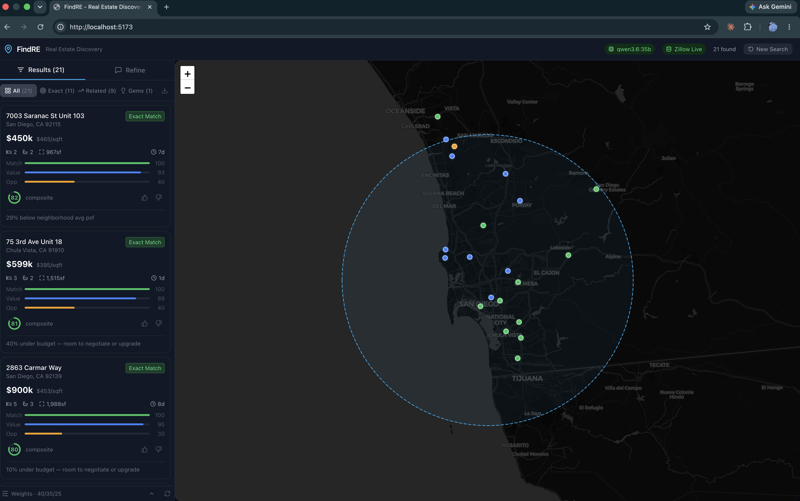
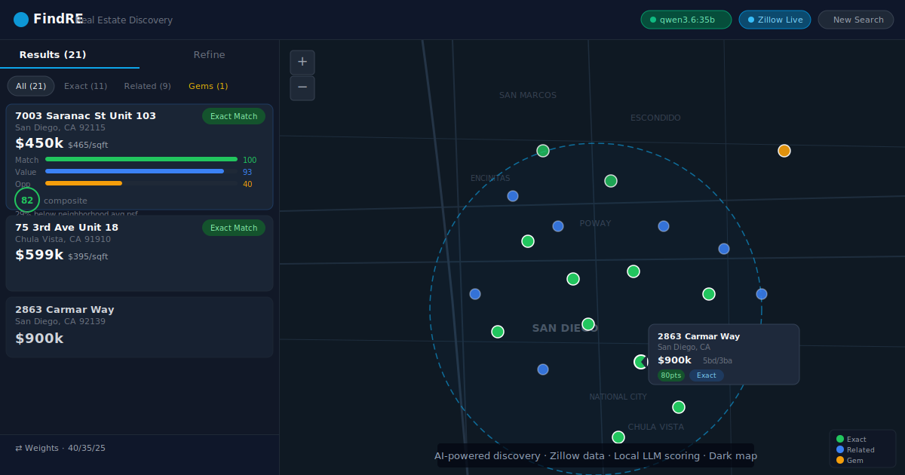

# FindRE — AI-Powered Real Estate Discovery Engine

> **Conversational search · Local LLM scoring · Live Zillow data · Dark map**



*FindRE running a live search in San Diego — 21 results scored by Match, Value, and Opportunity.*

---

## What it does

You describe your dream home in plain English. FindRE's AI intake agent turns that into structured search criteria, hits the Zillow API in real time, and scores every result across three dimensions: how well it **matches** your criteria, how good the **value** is versus the neighborhood, and how strong the **opportunity** signal is (days on market, price reductions). Results appear on a dark CartoDB map with color-coded pins; click any pin or card for a full AI-written explanation.

**Key capabilities**

- Conversational onboarding — budget, beds, must-haves, deal-breakers, lot size, single-family requirements, all in natural language
- Three-score system: Match / Value / Opportunity with user-adjustable weights
- Local LLM (Ollama + qwen3.6:35b) for structured intent extraction and property explanations — no data leaves your machine
- Hard post-search filters: drops condos/multi-family when a private lot is required; enforces `lot_size_min` before scoring
- Lot size verification flags — warns when Zillow doesn't list lot size so you can verify before scheduling a showing
- Session learning — weight adjustments adapt to your likes/dislikes over a session
- Demo mode — fully functional without a Zillow API key using seeded San Diego data

---

## Architecture

```
┌─────────────────────┐       ┌──────────────────────────────────────────┐
│   React 19 + Vite   │ ←───→ │              FastAPI (Python)             │
│   Tailwind CSS dark │  REST │                                           │
│   Zustand store     │       │  User Intent Agent  →  Nominatim geocoder │
│   Leaflet map       │       │  Zillow Provider    →  RapidAPI           │
│   CartoDB dark mat. │       │  Orchestrator       →  Hard filters       │
└─────────────────────┘       │  Scoring Agent      →  Match/Value/Opp   │
                              │  Explanation Agent  →  Ollama qwen3.6:35b │
                              │  aiosqlite cache    →  SQLite             │
                              └──────────────────────────────────────────┘
```

**Stack**

| Layer | Technology |
|---|---|
| Frontend | React 19, TypeScript, Vite, Tailwind CSS, Zustand |
| Map | Leaflet, CartoDB Dark Matter tiles |
| Backend | FastAPI, Python 3.11+, uv, aiosqlite |
| LLM | Ollama (local) — qwen3.6:35b |
| Property data | Zillow via RapidAPI (`zillo-realtime-scraper`) |
| Geocoding | Nominatim (free, no key required) |

---

## Quick Start

### Prerequisites

- Python 3.11+ with [uv](https://github.com/astral-sh/uv)
- Node.js 18+
- [Ollama](https://ollama.com) running locally with `qwen3.6:35b` pulled
- (Optional) RapidAPI key for live Zillow data — demo mode works without it

### 1. Clone and install

```bash
git clone https://github.com/mrodgers/findre.git
cd findre

# Backend
cd backend
uv sync

# Frontend
cd ../frontend
npm install
```

### 2. Configure environment

```bash
cp .env.example .env
# Edit .env — set ZILLOW_API_KEY if you have one (optional)
```

Or pass the key at runtime without storing it:

```bash
curl -X POST http://localhost:8000/api/config/zillow-key \
  -H "Content-Type: application/json" \
  -d '{"key": "YOUR_KEY_HERE"}'
```

### 3. Start Ollama

```bash
ollama serve
ollama pull qwen3.6:35b   # one-time, ~20 GB
```

### 4. Run

```bash
# Terminal 1 — backend
cd backend
uv run python main.py

# Terminal 2 — frontend
cd frontend
npm run dev
```

Open **http://localhost:5173** and start chatting.

---

## Usage

Type naturally into the chat box. Examples:

```
"3 bed house in San Diego under $800k, must have garage, no HOA"

"92120, budget $600k-900k, big backyard, not a condo"

"Looking for a fixer-upper near Chula Vista, single family only,
 lot at least 6000 sqft, $700k max"
```

FindRE will confirm what it captured and trigger a search automatically once it has location + budget. No "shall I proceed?" — it just goes.

**Score weights** — drag the sliders in the bottom bar to emphasize Match, Value, or Opportunity. Results re-rank in real time.

**Property cards** — click any card or map pin to expand a full AI explanation including why it matches, what makes it interesting, tradeoffs, and 3 highlight bullets.

**Categories**
- Exact (green) — high match score, meets core criteria
- Related (blue) — partial match or nearby with good value
- Gem (amber) — low match but exceptional opportunity/value signal

---

## API Key Security

The Zillow RapidAPI key is **never** hardcoded in source. It is:
1. Loaded from the `ZILLOW_API_KEY` environment variable at startup, or
2. Submitted via `POST /api/config/zillow-key` (in-memory only, not written to disk)

A `.gitignore` entry prevents `.env` from being committed.

---

## Configuration

| Env var | Default | Description |
|---|---|---|
| `ZILLOW_API_KEY` | — | RapidAPI key for Zillow scraper |
| `OLLAMA_BASE_URL` | `http://localhost:11434` | Ollama endpoint |
| `PORT` | `8000` | Backend port |

---

## Demo Mode

No API key? No problem. The app ships with seeded San Diego-area listings and uses those when Zillow isn't configured. The StatusBar shows **Demo Data** instead of **Zillow Live**. All scoring, explanations, and map features work identically.

---

## Project Layout

```
findre/
├── backend/
│   ├── agents/         # user_intent, orchestrator, scoring, explanation, discovery
│   ├── models/         # Pydantic schemas
│   ├── providers/      # Zillow provider + demo data
│   ├── routers/        # FastAPI routes
│   ├── services/       # Ollama service, cache
│   └── main.py
├── frontend/
│   ├── src/
│   │   ├── components/ # Chat, Map, PropertyCard, Layout
│   │   ├── store/      # Zustand store
│   │   └── services/   # API client
│   └── ...
└── docs/
    ├── userguide.html  # Full user guide (served at /docs)
    └── assets/         # Hero image, screenshots
```

---

## Docs

Full user guide: **http://localhost:8000/docs** (served by the backend)

---

## Zillow API Quota

The free RapidAPI tier has a monthly call limit. Each search uses approximately:
- 1 call to `/search_homes/index.php`
- Up to 10 calls to `/home_details/index.php` (detail enrichment for top results)

Monitor usage at [rapidapi.com](https://rapidapi.com). When the quota is exhausted, the StatusBar shows **Quota Exhausted (Demo)** and the app falls back to demo data automatically.

---

## Hero image



---

v1.0 · 2026-06-27
